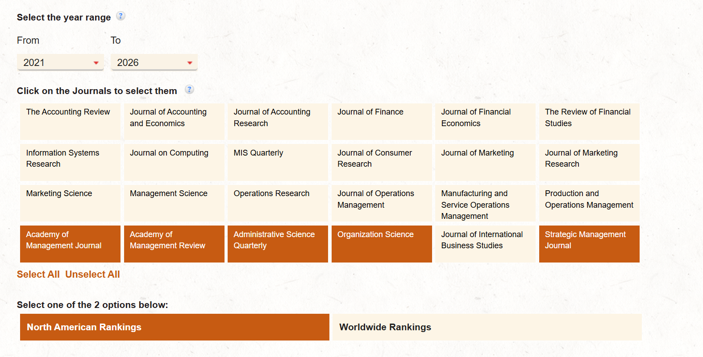

<a href="/pre-phd-advice/">← Back to Pre-PhD Advice</a>

# Where Should You Apply for a Strategy PhD?

If you already know you want to do a PhD in business, the next question is where you should apply.

Business PhDs are highly fragmented, and it's not always obvious where you fit in. I often have students come into my office knowing they want to study a phenomenon that interests them (like "I'm interested in how organizations use metrics" or "I'm interested in how AI will change innovation"), but not knowing where to go from there. Below is my in-depth guide to those students.

Keep in mind this is all from my perspective, so take it as one data point to triangulate with other perspectives.

## Which field? Is Strategy right?

The first question you need to answer is which field within business you want to focus on. The major options are:
- **Management**, which includes:
  - **Strategy & Entrepreneurship** (often combined and sometimes colloquially referred to as "macro")
  - **Organizational Behavior** (OB, sometimes referred to as "micro")
- **Marketing**
- **Operations and Supply Chain**
- **Accounting**
- **Finance**

Usually, the students who approach me are interested in some kind of Management PhD: Strategy/Entrepreneurship, or OB. The confusing part is that different business schools group these management fields in very different ways.

Some schools like Duke or UNC have separate strategy/entrepreneurship and OB departments. Some like Harvard Business School have separate Strategy, OB, and Entrepreneurship Units. Some like University of Washington have a single management department with combinations of people studying OB, Strategy, and Entrepreneurship in one department. Some like Wharton have a single management department but with fairly well-defined "strategy" and "OB" and "entrepreneurship" groups within them. Some like Stanford really don't even have a "strategy" group in the business school (though they do have strategy/entrepreneurship in the engineering school). Some like Northwestern have a department labeled as "strategy" but it's really just an econ department, and the actual management strategy people apply to the management department.

On top of all this confusion, each department has its own unique "flavor". For example, Duke strategy is clearly in the strategy field, but it operates like an applied Econ department, while UNC is much more interdisciplinary and open to qualitative research approaches. It's also possible to do a PhD in a more general social science discipline (like Econ, Sociology, Psychology) and get a business school job from there. It's very confusing, and hard to make sense of where you will fit in.

Keep in mind that regardless of how ambiguously departments are structured, as a PhD applicant (and PhD student and as a faculty member) you will be unambiguously understood as belonging to one of those tribes (strategy/entre or OB) and you will pretty much be **stuck with that label the rest of your career**. So it's worth understanding which field you are getting into, and being very clear about that in your application. Here's how I understand the biggest distinctions:

- **Strategy ("macro"):**
  - **Theme of the field:** what are the fundamental determinants of firm performance?
  - **Unit of analysis:** firm and organization-level analysis
  - **Outcomes of interest:** usually some type of firm performance
  - **Disciplinary focus:** primarily Economics, secondarily Sociology (including "Organization Theory") and some Psych
  - **Methods:** primarily large-n econometric studies, with a minority of qualitative in-depth industry and firm studies, and field experiments are becoming more popular

- **OB ("micro"):**
  - **Theme of the field:** what are the fundamental determinants of individual performance and well-being at work?
  - **Unit of analysis:** typically individuals
  - **Outcomes of interest:** usually some type of individual performance or well-being
  - **Disciplinary focus:** primarily Psychology
  - **Methods:** primarily lab studies

So, if I had to break it down in one pithy sentence, I'd say if you're interested in **firms** study **Strategy**, and if you're interested in **individuals** study **OB**.

Entrepreneurship is an interesting case because it's organized differently at every school. At some schools it's very much its own tribe (which sometimes spans the "macro" and "micro" camps), at other places it's lumped into strategy. Its unifying principle is that you are interested in the topic of new ventures. I'm not as certain how to guide you if that's your interest.

But if you are pretty convinced you want to apply to Strategy programs, then read on.

## Which Strategy Programs?

If you've made it this far I'm assuming you're pretty set on a strategy PhD.

You should look for a strategy program that has <u>all</u> of the following:
- Is a fairly **highly-ranked school**
- Has a **cluster of people studying topics that interest you**
- Has a history of **good PhD mentorship and placement**

Sometimes people say "don't apply to a good school, apply to a good mentor". There's some truth to that, but the value of a "good school" is pretty high too. For better or worse, academia is a status-driven career.

Which specific programs should you consider? As I hinted above, each school is different and you sort of have to understand each school on its own terms. So general categorical advice is tricky.

I'll start by telling you to which programs I applied. Keep in mind I was fairly Econ-inclined at the time, and felt fairly confident in my research experience, letters of recommendation, and test scores. I would actually change some of my recommendations for many strategy applicants as noted below. But I'll list every school application for context.

In no particular order:

- **Harvard Business School**, Technology and Operations Management (TOM) Department. **(Accepted)** Harvard does have a Strategy department and for most people I would recommend applying there. But at the time, the people I was most interested in were in the TOM department (including Clay Christensen, Rory McDonald, Raj Choudhury) and the department had a solid reputation as a strategy/innovation group. See, it's confusing!
- **Wharton** Management Department. **(Declined)** Wharton has different groups like Strategy, International Business, Entrepreneurship, and it's good to target people from a specific group. Wharton traditionally has a good reputation for PhD mentorship and placement.
- **Michigan** Strategy Department. **(No offer)** This is a "core" strategy program. Good reputation for PhD mentorship and placement.
- **NYU** Management and Organizations Department (strategy group). **(Declined)**
- **Maryland** Strategic Management and Entrepreneurship. **(No offer)** Another "core" strategy program. Good reputation for PhD mentorship and placement.
- **MIT** Technological Innovation, Entrepreneurship, and Strategic Management (TIES). **(No offer)** This is a great group with great PhD training, but very selective.
- **Columbia** Management Department (strategy group). **(No offer)**
- **INSEAD** Strategy department. **(Declined)** Great group but you have to be ok living in Singapore or France!
- **London Business School** Strategy & Entrepreneurship. **(No offer)** Great group but must be ok with international experience!
- **U of Minnesota**, Strategic Management & Entrepreneurship. **(Withdrew)** Good group of faculty for my interests at the time.
- **Duke** Strategy Department. **(Withdrew)** Econ heavy program, but still in the field of strategy. They typically consider fairly strong Econ candidates.
- **Northwestern** Managerial Economics and Strategy. **(No offer)** I actually think this was a mistake—it's a very Econ-oriented department and I should have applied to the Management and Organizations department given my interests.
- **UC Berkeley** Business and Public Policy. **(No offer)** Probably another mistake—it used to be a "core" albeit Econ-oriented strategy department that produced a lot of influential people in the field. But now it's fairly disconnected from the strategy field. You may want to consider the MORS department instead, though now it's fairly Psych and Soc focused.
- **UChicago Booth** Economics Department. **(No offer)** I do not recommend this for most Strategy applicants! This was just me also trying some other programs. These people have nothing to do with the field of Strategy.

Other programs I would consider if I were applying today:
- **Cornell** Management. Historically strong BYU pipeline. Generally more "Organization Theory" than "Economics" focused.
- **Stanford** Technology Ventures Program. This is in the college of engineering and historically it was a great pipeline for BYU students, especially those interested in rich qualitative work studying strategic decision-making in cutting-edge tech companies in the Bay Area. Now the primary mentor of many past BYU students, Kathy Eisenhardt, is retiring, so it's unclear to me how this will look in the future. Note that the Business School doesn't really have a strategy program. Too bad!
- **University of Virginia** Strategy, Ethics, and Entrepreneurship. This PhD program is relatively new and didn't exist at the time I applied. But it's a fantastic group of faculty and I'm well-positioned to write letters there since I know many of the faculty including my HBS advisor Rory McDonald.
- **U of Southern California** Management.
- **U of Washington** Management Department (Strategic Management or Technology Entrepreneurship application). This is a great group of faculty I know well and I'm happy to discuss further.
- **Washington University in St. Louis** Strategy Group.
- **UT Austin** Management.
- **U of North Carolina** Strategy & Entrepreneurship.
- **U of Wisconsin** Management and Human Resources.
- **Boston University**. History of good placement especially with certain mentors.

There are also other programs I may have missed, especially depending on your interests and goals. One data point you can add to find other interesting programs is the school's rankings by research productivity at the top 5 management journals in the last 5 years. You want to go to a department that is highly research productive. <a href="https://jsom.utdallas.edu/the-utd-top-100-business-school-research-rankings/search#rankingsByJournal" target="_blank" rel="noopener noreferrer">https://jsom.utdallas.edu/the-utd-top-100-business-school-research-rankings/search#rankingsByJournal</a>. Filter for the most important management journals:

The caution here is that high productivity may come from the OB side rather than strategy.

Another way to see which institutions train core strategy students is to look at the PhD Institutions of the students who went to the CCC conference over the years (it's like a beauty contest for top Strategy PhD candidates). You can see them here: <a href="https://www.ccc-community.org/alumni" target="_blank" rel="noopener noreferrer">https://www.ccc-community.org/alumni</a> (sort by PhD institution to get a decent sense. You'll see it mostly aligns with my recommendations. Pay attention to the CCC cohort year column!)

I recommend spending a few hours clicking around on faculty profile pages on the management/strategy pages of all these schools listed above. Get a sense of which faculty are publishing in the top journals (see the screenshot above). What topics are they publishing in? Are they publishing with PhD students? Who is actually research active (published in A journals in the last couple years)?

Also look at PhD placements, if available. Which programs are placing well? (e.g. see Maryland's Alumni page here: <a href="https://www.rhsmith.umd.edu/programs/phd/academics/areas-specialization/strategic-management-entrepreneurship-sm" target="_blank" rel="noopener noreferrer">https://www.rhsmith.umd.edu/programs/phd/academics/areas-specialization/strategic-management-entrepreneurship-sm</a>). Careful to notice for some programs which placements were actually strategy (rather than OB) as some Management departments may place much better in one than another.

Manually going through the process of clicking around faculty pages and program websites will be time-consuming, but it will be time well spent. It is one of the only ways to develop a sense of which programs, topics, and people you will want to target. Your knowledge and notes from this process will also help you write your semi-customized statement of purpose for each school when that time comes.

In the end, you should expect to apply to ~10-20 schools. Be fairly open in the programs you consider, but don't apply anywhere you know you wouldn't go for whatever reason. Good luck and let me know if you have any questions!

Not sure a PhD is right for you in the first place? Start with [Should You Do a Business PhD?](/pre-phd-advice/should-you-do-a-business-phd/) Questions? [Come talk to me](/contact/).
